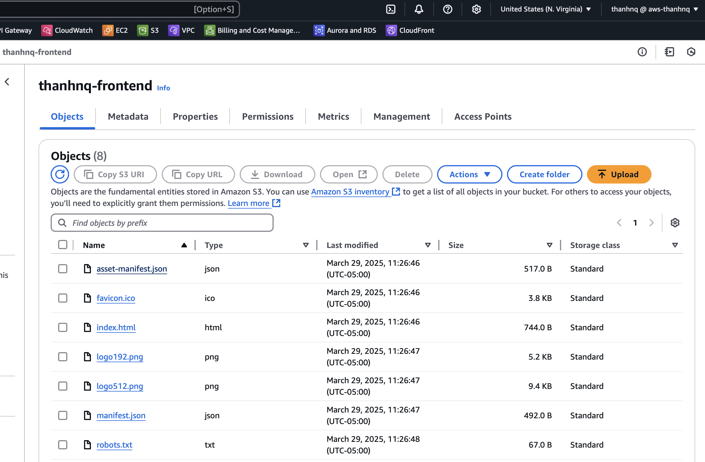
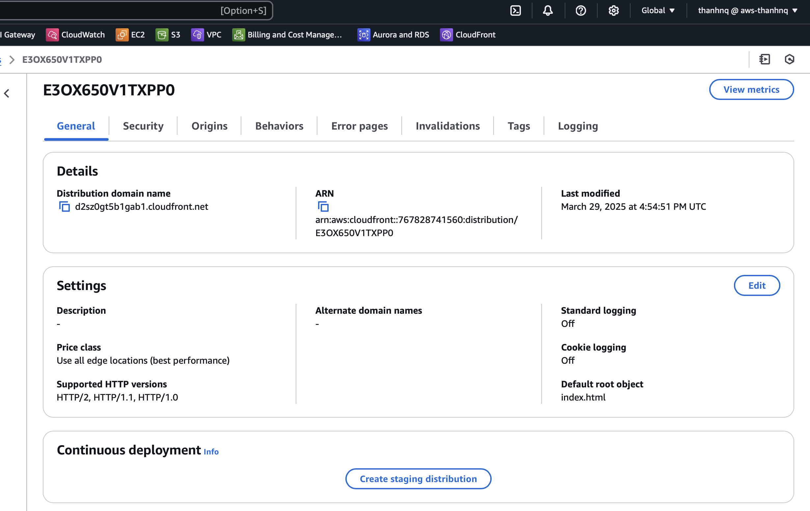
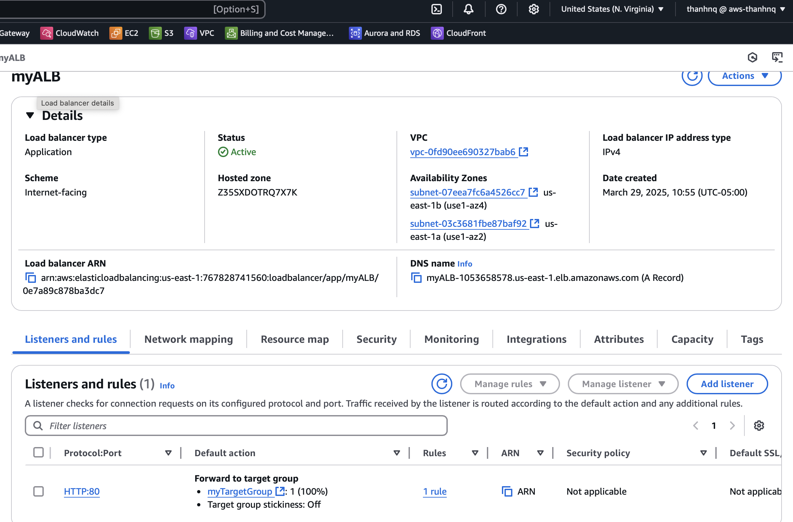
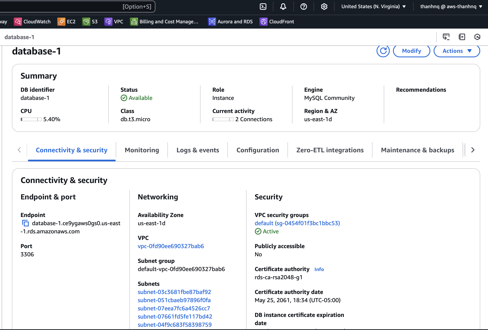
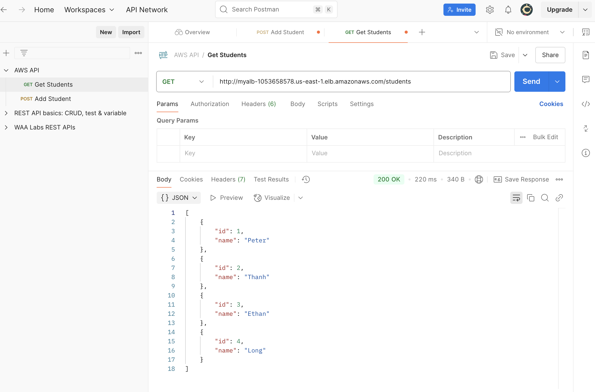
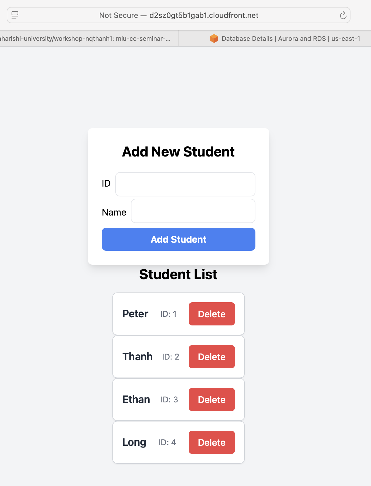

# MIU-Seminar-2025-03-Workshop
# Requirements
## Set Up RDS
* Launch an RDS/Aurora (MySQL) database.
* Create an EC2 instance 
* Connect EC2 with the above database and initialize it:
```
CREATE DATABASE <your-name>;
USE <your-name>;
CREATE TABLE student(id INT PRIMARY KEY, name VARCHAR(255) NOT NULL);
```
## Launch 2 public EC2 Instances for the backend 
* Launch an EC2 instance with public IP.
* Connect to the instance using SSH.
* Install Node.js: sudo yum install -y nodejs
* Install Git: sudo yum install -y git
* Clone source code from the above repo: https://github.com/Thao-V/MIU-CC-Seminar-2025-03-CodeDemo
* Navigate to the directory: cd MIU-CC-Seminar-2025-03-CodeDemo/backend
* Create the .env file from env_example: cp env-example .env
* Update the .env file with the above database. 
* Install dependencies: npm install
* Run the app (this application will run on port 6003): npm start
* Test the below restful API from this backend using host `http://<public-ip>:6003`
```
1. GET /students: Return all students
2. POST /students: Add a new students. Send with body with the student info. e.g. {name: "Peter", id: "01"}
3. DELETE /students/:id: Delete a student by id
```

## Setup an ALB to distribute traffic
* Create an Application Load Balancer (ALB).
* Attach it to the above EC2 instances.
* Use Postman or any tool to send requests to ALB.

## Setup an S3 Bucket & CloudFront
* Ensure that NodeJS v18 or above is installed in your local computer.
* Clone source code from the repo: https://github.com/Thao-V/MIU-CC-Seminar-2025-03-CodeDemo
* Go to the director: cd MIU-CC-Seminar-2025-03-CodeDemo/frontend
* Install dependencies: npm install
* Configure the .env file: REACT_APP_API_URL=https://<your-api-endpoint>
* Run locally: npm start
* Build the source code, which will generate the build directory: npm run build
* Create an S3 bucket
* Upload the content of the build directory above to the S3 bucket.
* Create a CloudFront, which connects to the S3 bucket using OAC.
* Test CloudFront DNS and see if the website loads.

## Submit screenshots demonstrating:
* S3 bucket

* CloudFront

* ALB configuration

* RDS database configuration

* API response from EC2 application

* Website using CloudFront DNS

